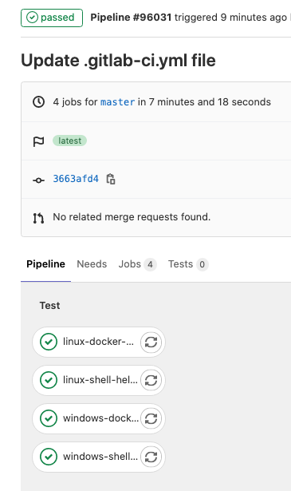

# GitLab HA Scaling Runner Vending Machine for AWS

**High Availability, Elastic Scaling, Spot & Windows**

# Table of Contents

[[_TOC_]]

[See what's Changed Over Time in the CHANGELOG.md](./CHANGELOG.md)

### Vending Machine?

**Vending Machine** is a metaphor for self-service - also known by the handles Service Management Automation (SMA), Service Catalog - it enables developers to build their own Infrastructure by picking it from a menu or being super simple to deploy.

### Many Strategic Features Built In (TL;DR)

The list of built-in features - things you don't have to engineer your - is so long most folks do a TL;DR and so they are now covered in [FEATURES.md](./FEATURES.md) The feature categories are: **Scaled Runner Management Built-In, Runner Cost Management Built-In, Runner Configuration Best Practices, Security, High Availability, Elastic Scaling, AWS Features and Best Practices,Extensibility, Reusability and Troubleshooting, and Supported Combinations of Operating Systems, Runner Executors and Hardware Architectures.**
### Easy Buttons

[Walkthrough Video of the Easy Button Capability](https://youtu.be/2dXw8Dx6ENw)

Even if you start with an easy button, you can go back in and do a stack update, you can make your runner more sophisticated after initial deployment.

Clicking the icon in the Easy Button column below will launch the specific example in the CloudFormation Console.

You will need your GitLab Instance URL and one or more Runner Registration Tokens (semicolon delimited for multiples).  

**Note:** Runner Registration tokens are in the CI/CD settings of every group and every project on a GitLab instance. They are also available the Instance level for self-managed instances.  When you register a runner at the group or instance level, it is available to all projects in the downbound group heirarchy.

**Note:** The region will automatically be us-east-1, change to your desired region before submitting.
### Easy Buttons Provided

**Note:** The easy button code in this project is easy to reuse as a pattern to create your own easy button setups for the CloudFormation Console UI or the CLI.
**Note:** that you can deploy as many of these as you wish as many times as you wish to build runner clusters with the appropriate attributes.

| Easy Buttons                                                 | Name                                                         | Description                                                  |
| ------------------------------------------------------------ | ------------------------------------------------------------ | ------------------------------------------------------------ |
| [](https://us-west-2.console.aws.amazon.com/cloudformation/home?region=us-west-2#/stacks/create/review?templateURL=https://gl-public-templates.s3.amazonaws.com/cfn/v1.4.5-alpha10/easybutton-amazon-linux-2-docker-manual-scaling-with-schedule-ondemandonly.cf.yml&stackName=linux-docker-nonspot) | Amazon Linux 2 Docker HA with Manual Scaling and Optional Scheduling. Non-spot. | Desired capacity of 1 enables WARM HA through ASG Respawn.<br />Desired capacity of 2 enables HOT HA since loss of a node does not make the service unavailable. <br />Desired capacity of 3 or more enables HOT HA and manual scaling of runner fleet. No Spot.<br />**Default choice for Linux Docker executor.** |
| [](https://us-west-2.console.aws.amazon.com/cloudformation/home?region=us-west-2#/stacks/create/review?templateURL=https://gl-public-templates.s3.amazonaws.com/cfn/v1.4.5-alpha10/easybutton-amazon-linux-2-docker-manual-scaling-with-schedule-spotonly.cf.yml&stackName=linux-docker-spotonly) | Amazon Linux 2 Docker HA with Manual Scaling and Optional Scheduling. 100% spot. | Desired capacity of 1 enables WARM HA through ASG Respawn.<br />Desired capacity of 2 enables HOT HA since loss of a node does not make the service unavailable.<br />Desired capacity of 3 or more enables HOT HA and manual scaling of runner fleet. <br />**100% Spot.** |
| [](https://us-west-2.console.aws.amazon.com/cloudformation/home?region=us-west-2#/stacks/create/review?templateURL=https://gl-public-templates.s3.amazonaws.com/cfn/v1.4.5-alpha10/easybutton-windows2019-shell-manual-scaling-with-scheduling-ondemandonly.cf.yml&stackName=win2019-shell-non-spot) | Windows 2019 Shell with Manual Scaling and Optional Scheduling. Scaling and Optional Scheduling. Non-spot. | Desired capacity of 1 enables WARM HA through ASG Respawn.<br />Desired capacity of 2 enables HOT HA since loss of a node does not make the service unavailable.<br />Desired capacity of 3 or more enables HOT HA and manual scaling of runner fleet. <br />**Default choice for Windows Shell executor.** |
| [](https://us-west-2.console.aws.amazon.com/cloudformation/home?region=us-west-2#/stacks/create/review?templateURL=https://gl-public-templates.s3.amazonaws.com/cfn/v1.4.5-alpha10/easybutton-windows2019-shell-manual-scaling-with-scheduling-spotonly.cf.yml&stackName=win2019-shell-spot) | Windows 2019 Shell with Manual Scaling and Optional Scheduling. 100% spot. | Desired capacity of 1 enables WARM HA through ASG Respawn.<br />Desired capacity of 2 enables HOT HA since loss of a node does not make the service unavailable.<br />Desired capacity of 3 or more enables HOT HA and manual scaling of runner fleet. <br />**100% Spot.** |
|                                                              | **More Advanced Options Including AutoScaling**              |                                                              |
| [](https://us-west-2.console.aws.amazon.com/cloudformation/home?region=us-west-2#/stacks/create/review?templateURL=https://gl-public-templates.s3.amazonaws.com/cfn/v1.4.5-alpha10/easybutton-amazon-linux-2-docker-simple-scaling-ondemand.cf.yml&stackName=linux-docker-scaling-spotonly) | Amazon Linux 2 Docker Simple Scaling Ondemand Instances      | Two docker executors, scaling based on simple CPU metrics, only spot<br />**Note:** Actual scaling parameters used in this MVP are just to show how to configure scaling - they are untested with Runner workloads - your can help by contributing your tested scaling parameters in an issue. |
| [](https://us-west-2.console.aws.amazon.com/cloudformation/home?region=us-west-2#/stacks/create/review?templateURL=https://gl-public-templates.s3.amazonaws.com/cfn/v1.4.5-alpha10/easybutton-amazon-linux-2-docker-simple-scaling-spotonly.cf.yml&stackName=linux-docker-scaling-spotonly) | Amazon Linux 2 Docker Simple Scaling Spot Instances          | Two docker executors, scaling based on simple CPU metrics, only spot<br />**Note:** Actual scaling parameters used in this MVP are just to show how to configure scaling - they are untested with Runner workloads - your can help by contributing your tested scaling parameters in an issue. |
| [](https://us-west-2.console.aws.amazon.com/cloudformation/home?region=us-west-2#/stacks/create/review?templateURL=https://gl-public-templates.s3.amazonaws.com/cfn/v1.4.5-alpha10/easybutton-amazon-linux-2-docker-simple-scaling-spot-and-ondemand.cf.yml&stackName=linux-docker-scaling-both) | Amazon Linux 2 Docker Simple Scaling Spot and Ondemand Instances (Mixed Instances) | Two docker executors, scaling based on simple CPU metrix, 50/50 mix of spot and ondemand.<br />**Note:** Actual scaling parameters used in this MVP are just to show how to configure scaling - they are untested with Runner workloads - your can help by contributing your tested scaling parameters in an issue. |
| [](https://us-west-2.console.aws.amazon.com/cloudformation/home?region=us-west-2#/stacks/create/review?templateURL=https://gl-public-templates.s3.amazonaws.com/cfn/v1.4.5-alpha10/easybutton-amazon-linux-2-arm64-docker-simple-hot-ha.cf.yml&stackName=linuxarm-docker-hot-ha) | Amazon Linux 2 Docker Simple Hot HA Using **ARM**            | Two docker executor instances that will respawn if they terminate, no autoscaling, no spot instances, **arm64 architecture**. |
| [](https://us-west-2.console.aws.amazon.com/cloudformation/home?region=us-west-2#/stacks/create/review?templateURL=https://gl-public-templates.s3.amazonaws.com/cfn/v1.4.5-alpha10/easybutton-windows2019-shell-simple-scaling-ondemand.cf.yml&stackName=win2019-shell-scaling-nospot) | Windows 2019 Shell Simple Scaling Ondemand Instances         | Two docker executors, scaling based on simple CPU metrics, no spot.<br />**Note:** Actual scaling parameters used in this MVP are just to show how to configure scaling - they are untested with Runner workloads - your can help by contributing your tested scaling parameters in an issue. |
| [](https://us-west-2.console.aws.amazon.com/cloudformation/home?region=us-west-2#/stacks/create/review?templateURL=https://gl-public-templates.s3.amazonaws.com/cfn/v1.4.5-alpha10/easybutton-windows2019-shell-simple-scaling-spotonly.cf.yml&stackName=win2019-shell-scaling-spotonly) | Windows 2019 Shell Simple Scaling Spot Instances             | Two docker executors, scaling based on simple CPU metrics, only spot.<br />**Note:** Actual scaling parameters used in this MVP are just to show how to configure scaling - they are untested with Runner workloads - your can help by contributing your tested scaling parameters in an issue. |
| [](https://us-west-2.console.aws.amazon.com/cloudformation/home?region=us-west-2#/stacks/create/review?templateURL=https://gl-public-templates.s3.amazonaws.com/cfn/v1.4.5-alpha10/easybutton-windows2019-shell-simple-scaling-spot-and-ondemand.cf.yml&stackName=win2019-shell-scaling-both) | Windows 2019 Shell Simple Scaling Spot and Ondemand Instances (Mixed Instances) | Two docker executors, scaling based on simple CPU metrics, 50/50 mix of spot and ondemand.<br />**Note:** Actual scaling parameters used in this MVP are just to show how to configure scaling - they are untested with Runner workloads - your can help by contributing your tested scaling parameters in an issue. |

**Not An Easy Button Person?** If easy buttons aren't your thing, click here to load the full template in CloudFormation - the help text in the parameters gives a lot of information - but you may also need to consult this documentation: [](https://us-west-2.console.aws.amazon.com/cloudformation/home?region=us-east-1#/stacks/create/review?templateURL=https://gl-public-templates.s3.amazonaws.com/cfn/v1.4.5-alpha10/GitLabElasticScalingRunner.cf.yml&stackName=GitLabElasticScalingRunner-AllParameters) (Recommended: add the tags Product=GitLab, Function=GitLabRunner)

### Easy Buttons In the CLI

The easy buttons above use a parent CloudFormation Template.  While it simplifies the first launch graphical experience - it also adds a nest stack that is not needed if you are deploying using code.

Note that you can override parameter file values on the command line - which is used here to provide the url and runner registration tokens.

1. Install aws cli and or use the container
2. Setup your local credentials or use them on the command line (or however your security or IT department requires you to use them locally)
3. Clone the repository locally and change to it's directory
4. Examine the subdirectory easy_button/params to find the parameter set name you want to use (should be ones to correlate to each of the above easy button setups) and select it and substitute the name for `amazon-linux-2-docker-simple-hot-ha.cfparameters.json` in the below.
5. Before submitting, customize the following command with your values for "3GITLABRunnerInstanceURL" and "3GITLABRunnerRegTokenList"

```
aws cloudformation create-stack --stack-name "mynewrunner" --template-url https://s3.us-west-2.amazonaws.com/gl-public-templates/cfn/GitLabElasticScalingRunner.cf.yml --capabilities CAPABILITY_NAMED_IAM --parameters $(cat easy-button-parameter-sets/amazon-linux-2-docker-simple-hot-ha.cfparameters.json | jq -r '.[] | "ParameterKey=" + .ParameterKey + ",ParameterValue=" + .ParameterValue') ParameterKey="5ASGInstanceType1",ParameterValue="m5.xlarge" ParameterKey="3GITLABRunnerInstanceURL",ParameterValue="https://gitlab.com"  ParameterKey="3GITLABRunnerRegTokenList",ParameterValue="your-list-of-comma-seperated-tokens"
```

### Walk Through Video of Full Template

This video does not cover everything in this readme - both need to be reviewed to be productive with this code.

[GitLab Runner Vending Machine for AWS: HA and/or Autoscaling on AWS with Spot](https://youtu.be/llbSTVEeY28)

### AWS Service Catalog and QuickStarts

The easy button parent cloudformation templates and the underlying full template are compatible with AWS Service Catalog.

### Don't Need Scaling Or Just One Runner?  You're In The Right Place

This template still has a lot of benefits when not used for autoscaling, some of them are:

- Self-Service Vending (SMA) of Runners by Developers.
- Runners are built with IaC, rather than hand crafted.
- Automatic Hot (2 hosts) or Warm (1 host that respawns) High Availability.
- Automatic availability scheduling (runner is off during off hours).
- Use of Spot Compute.

### The Runner Part

Runner Specific or Highlighted Features:
- Start / Stop ASG schedule - specify a cron expression for when the cluster scales to 0 for Min and Desired (stop schedule) and when it scales to "Min=1" "Desired=<yourvalue> " (start schedule), after which autoscaling takes over.
- Runner information tagged in AWS and instance name and AWS account set as runner name for easy mapping of runners in GitLab to instances in AWS and vice versa.
- Runners self-tag as computetype-spot or computetype-ondemand to allow GitLab CI job level routing based on this information.
- Runners self-tag with gitlab runner executor type

Each runner supported as a bash or powershell script in the "runner_configs" directory. The parameter that take these scripts can be point to any available URL. When pointing it to GitLab, be sure to use a full raw URL that is accessible directly from your instance as it spins up in AWS.

These are then referenced in the primary Cloud Formation template in the CloudFormation parameter 3INSTConfigurationScript.

Currently the windows one is the most developed (because scaling shell runners is a need).

Note that these runner scripts have the following attributes (when fully completed):
* They are pulled dynamically by instances that are scaling - so they cannot use CloudFormation variable substitutions because that is done long before these are pulled and used.
* They must overwrite the TerminationMonitor script built into the CF template so that they can properly drain and unregister a runner on a scale-in operation.
* They rely on variable pass through from the main cloud formation code
* For runners with docker, the user should just provide an AWS prepared Amazon Linux 2 or Windows AMI with docker preinstalled in parameter
* They follow the best practice of using AWS ASG lifecycle hooks to give the instance time to be built - but more importantly, to allow it to drain and unregister on scale-in.
* They name and tag runners in both AWS and GitLab to ensure easy cross-system identification.

### Should I bother using this scaled runner template for Docker-machine since it has scaling built in?

Yes - because:
* By having your entire runner build in an ASG you are making your runner provisioning production-grade because it is IaC (built with code)
* When you end up with runner sprawl, the prospect of updating all runners is much less daunting if they are all built with IaC
* the dispatcher node should be in a single instance ASG for warm HA (respawn on death).  
* It benefits from all the other features of this template including maintenance by repulling the latest AMI, latest patches and latest runner version upon a simple CF stack update.
* Docker-machine should be able to be completely replaced by a well tuned ASG housing the plain docker executor.

### Maintenance And Updates Built-In

The power of going back into a Runner ASG CloudFormation stack and changing stuff is pretty awesome.

Things you can do include:

1. Make one change an update to the latest AMI, give it the latest patches and update to the latest runner.
2. If you break something in step 1, go back in and peg the AMI and/or Runner version.  Or use an older runner version because you want to match the older version of your Self-hosted instance.
3. Add, remove, redo runner registration tokens to the ASG.
4. Change on/off schedules, scaling metrics, instance types, etc.
5. If you picked simplified parameters to get going and now want to do something advanced like enable autoscaling.

Essentially anything that is parameter can be changed and an update will be pushed.

### TroubleShooting Guide For All The IaC Parts

**IMPORTANT**: The number one suspected cause in debugging cloud automation is "You probably are not being patient enough and waiting long enough to see the desired result." (whether waiting for automation to complete or metrics to flow or other things to trigger as designed)

Here is the [Testing and Troubleshooting Guide](./TESTING-TROUBLESHOOTING.md)

### Prebuilt Runner Configuration Scripts

The follow Runner configuration scripts are provided with the template.

Note: The runner configuration script CloudFormation parameter can take an git raw URL on the public internet - so you can also iterate forward on any runner configuration by starting with these and placing it on a public repository somewhere.

| Runner Executor                                              | Readiness                                                    | Script Name (Last file on full Git RAW URL) |
| ------------------------------------------------------------ | ------------------------------------------------------------ | ------------------------------------------- |
| Linux Docker on Amazon Linux 2                               | - Working: Termination Monitor / Unregister<br />- Working: Reporting CPU & Memory in CloudWatch<br />- Working: CPU and Memory Scaling | amazon-linux-2-docker.sh                    |
| Linux Shell on Amazon Linux 2                                | - Working: Termination Monitor / Unregister<br />- Working: Reporting CPU & Memory in CloudWatch<br />- Working: CPU and Memory Scaling | amazon-linux-2-shell.sh                     |
| Windows Shell on Whatever Windows AMI You Choose             | - Working: Termination Monitor / Unregister<br />- Working: Reporting CPU & Memory in CloudWatch<br />- Working: CPU Scaling<br />- **NOT** Working: Memory Scaling | windows-shell.ps1                           |
| Windows Docker on Whatever **ECS Optimized** Windows AMI You Choose (Docker preinstalled) | - Working: Termination Monitor / Unregister<br />- Working: Reporting CPU & Memory in CloudWatch<br />- Working: CPU Scaling<br />- **NOT** Working: Memory Scaling | windows-docker.ps1                          |

Note: Unregistration upon termination happens only when the ASG initiates the termination.  Manipulate the ASG's "Desired" and "Minimum" counts to force this type of termination.  Terminating the instance from the EC2 Console will leave an ophaned runner registration in GitLab.

### GitLab CI YAML Hello World

```bash

linux-docker-helloworld:
  image: bash
  script:
    - |
      echo "Hello from the linux bash container"

linux-shell-helloworld:
  tags:
    - TagA
    - TagB
    - computetype-ondemand
    - glexecutor-shell
    - linux
  script:
    - |
      echo "Hello from the linux bash container"

windows-shell-helloworld:
  tags:
    - TagA
    - TagB
    - computetype-ondemand
    - glexecutor-shell
    - windows
  script:
    - |
      write-host "Hello from a Windows Shell runner"    

windows-docker-helloworld:
  image: mcr.microsoft.com/windows/servercore:ltsc2019
  tags:
    - TagA
    - TagB
    - computetype-ondemand
    - glexecutor-docker-windows
    - windows
  script:
    - |
      write-host "Hello from the windows ltsc2019 container"
```

Successful status from the above:



### Example GitLab Runners Display

Shows all four types registered.


