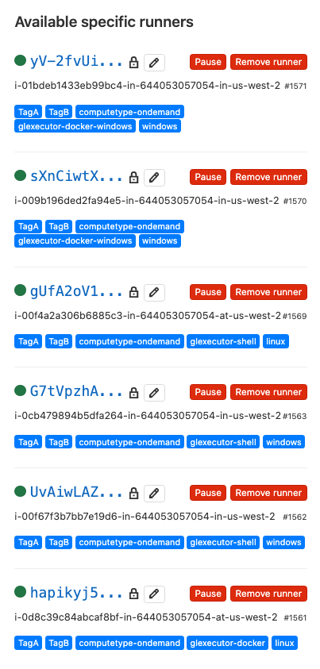

# GitLab HA Scaling Runner Vending Machine for AWS

**High Availability, Elastic Scaling, Spot & Windows**

# Table of Contents

[[_TOC_]]

### Vending Machine? HA? Scaling?

**Vending Machine** is a metaphor for self-service - also known by the handles Service Management Automation (SMA), Service Catalog - it enables developers to build their own Infrastructure by picking it from a menu or being super simple to deploy.

**Scaling** - using standard AWS services (ASG)

**HA** - in AWS ASGs are also used for HA even if there is no automatic scaling.

### Built Upon

The baseline for this template is the Ultimate AWS ASG Kickstart and Lab Kit with Spot Support.  It has many features and attibutes to learn about Autoscaling and spot and all of that is described here: https://gitlab.com/DarwinJS/ultimate-aws-asg-lab-kit/-/blob/master/README.md - It's worth it to read through the many features.

### Walk Through Video

This video does not cover everything in this readme - both need to be reviewed to be productive with this code.

[GitLab Runner Vending Machine for AWS: HA and/or Autoscaling on AWS with Spot](https://youtu.be/llbSTVEeY28)

### Only Need HA Runners or Self-Service?  You're In The Right Place

This template still has a lot of benefits when not used for autoscaling, some of them are:

- Self-Service Vending (SMA) of Runners by Developers.
- Runners are built with IaC, rather than hand crafted.
- Automatic Hot (2 hosts) or Warm (1 host that respawns) High Availability.
- Automatic availability scheduling (runner is off during off hours).

### Easy Buttons

Even if you start with an easy button, you can go back in and do a stack update, you can make your runner more sophisticated after initial deployment.

**Note:** Clicking the icon in the Easy Button column below will launch the specific example in the CloudFormation Console.

### Easy Buttons Provided

| Easy Button                                                  | Name                                                         | Description                                                  |
| ------------------------------------------------------------ | ------------------------------------------------------------ | ------------------------------------------------------------ |
| [](https://us-west-2.console.aws.amazon.com/cloudformation/home?region=us-west-2#/stacks/create/review?templateURL=https://gl-public-templates.s3-us-west-2.amazonaws.com/cfn/v1.4.0-alpha6/easybutton-amazon-linux-2-docker-simple-hot-ha.cf.yml) | Amazon Linux 2 Docker Simple Hot HA                          | Two docker executor instances that will respawn if they terminate, no autoscaling, no spot instances. |
|                                                              | Amazon Linux 2 Docker Simple Scaling Ondemand Instances      | Two docker executors, scaling based on simple CPU metrics, no spot |
|                                                              | Amazon Linux 2 Docker Simple Scaling Spot Instances          | Two docker executors, scaling based on simple CPU metrix, only spot |
|                                                              | Amazon Linux 2 Docker Simple Scaling Spot and Ondemand Instances (Mixed Instances) | Two docker executors, scaling based on simple CPU metrix, 50/50 mix of spot and ondemand |
|                                                              | Amazon Linux 2 Docker Simple Hot HA Using ARM                | Two docker executor instances that will respawn if they terminate, no autoscaling, no spot instances, arm64 architecture |
|                                                              | Windows 1903 Shell Simple Hot HA                             | Two docker executor instances that will respawn if they terminate, no autoscaling, no spot instances. |
|                                                              | Windows 1903 Shell Simple Scaling Ondemand Instances         | Two docker executors, scaling based on simple CPU metrics, no spot |
|                                                              | Windows 1903 Shell Simple Scaling Spot Instances             | Two docker executors, scaling based on simple CPU metrix, only spot |
|                                                              | Windows 1903 Shell Simple Scaling Spot and Ondemand Instances (Mixed Instances) | Two docker executors, scaling based on simple CPU metrix, 50/50 mix of spot and ondemand |

**Not An Easy Button Person?** If easy buttons aren't your thing, click here to load the full template in CloudFormation - the help text in the parameters gives a lot of information - but you may also need to consult this documentation: [](https://us-west-2.console.aws.amazon.com/cloudformation/home?region=us-east-1#/stacks/create/review?templateURL=https://gl-public-templates.s3-us-west-2.amazonaws.com/cfn/v1.4.0-alpha6/GitLabElasticScalingRunner.cf.yml)

### Easy Buttons In the CLI

The easy buttons above use a parent CloudFormation Template.  While it simplifies the first launch graphical experience - it also adds a nest stack that is not needed if you are deploying using code.

Note that you can override parameter file values on the command line - which is used here to provide the url and runner registration tokens.

1. Install aws cli and or use the container
2. Setup your local credentials or use them on the command line (or however your security or IT department requires you to use them locally)
3. Clone the repository locally and change to it's directory
4. Examine the subdirectory easy-button-parameter-sets to find the parameter set name you want to use (should be ones to correlate to each of the above easy button setups) and select it and substitute the name for `amazon-linux-2-docker-simple-hot-ha.cfparameters.json` in the below.
5. Before submitting, customize the following command with your values for "3GITLABRunnerInstanceURL" and "3GITLABRunnerRegTokenList"

```
aws cloudformation create-stack --stack-name "mynewrunner" --template-url https://s3.us-west-2.amazonaws.com/gl-public-templates/cfn/GitLabElasticScalingRunner.cf.yml --capabilities CAPABILITY_NAMED_IAM --parameters $(cat easy-button-parameter-sets/amazon-linux-2-docker-simple-hot-ha.cfparameters.json | jq -r '.[] | "ParameterKey=" + .ParameterKey + ",ParameterValue=" + .ParameterValue') ParameterKey="5ASGInstanceType1",ParameterValue="m5.xlarge" ParameterKey="3GITLABRunnerInstanceURL",ParameterValue="https://gitlab.com"  ParameterKey="3GITLABRunnerRegTokenList",ParameterValue="your-list-of-comma-seperated-tokens"
```

### AWS Service Catalog and QuickStarts

The easy button parent cloudformation templates and the underlying full template are compatible with AWS Service Catalog.

### Design Heuristics

#### Use Boring AWS/IaC Technology
In this case of this effort, sticking to broadly known, well proven AWS infrastructure the solution is open to much more tweaking and contributions by a very wide audience of GitLab users, but also the technical professionals helping GitLab customers in the entire Partner and Alliance ecosystem.  All of these professionals are also potential contributors due to familiar with the technologies in use. It also extends the reach to other APIs.
Some examples of leverage well proven and broadly known (boring) AWS technology:

- Using standard ASGs for scaling orchestration.
- Using EC2 instance compute.
- Using CloudFormation as the Infrastructure as Code Language (enables this to become an AWS QuickStart). Being a QuickStart exposes the code to an even vaster body of professionals for debugging, refinement and enhancement.
#### Abstraction (not Elimination) of Complexity of Sophisticated Architecture
As a solution becomes more sophisticated to handle use cases well or handle more cases, it naturally becomes more complex. Instead of keeping the internal implementation simple, the user experience can be abstracted.  In the case of Infrastructure as Code tooling, this generally comes down to simplifying the number of parameters that must be considered to deploy the solution for a given purpose.  There are multiple ways to front end this template with profiles of parameters to suite specific use cases.
### Why Amazon Linux 2?

AWS has engineered Amazon Linux 2 for the maxium efficiency and server density on Ec2 and for container hosts. With the newer Linux kernel it is also able to have more optimal docker performance with the overlay2 storage driver.

The defaulting of this template does not preclude anyone from creating a custom runner configuration script for any other bistro.  Generally you want to build on the AMIs built by AWS because they tend to be optimized with at least MVNe storage drivers and ENA network drivers.

### What Instance Types?

Do not use bursty instances types (t2/t3) - **especially in testing** where your expecations will be formed - because their irradict behavior will confuse the results for what autoscaling can do - especially how responsive and smooth it might be for the given workloads.

Do use nitro instances because they have MVNe storage drivers and ENA network drivers and are automatically EBS optimized.  Use a minimum of the m5 class to gain all these benefits in a general computing instance type.  Better performance may be had if you tune your instance selection to your actual workload behaviors.

### Should I Create an AMI with the Runner Embedded?

Generally no - this creates an entire artifact release cycle in front of an already complex Infrastructure as Code stack - testing is long enough without that additional development cycle.  Additionally, you will likely have to update the runner binary (and maybe others) as soon as you boot an old AMI.  Many times automation to adequately replace software will take longer than starting with a clean machine.  Developing automation to "replace an old software package" is definitely more intense that clean slate.

### Running This in CloudFormation

1. Clone the repository locally.
2. Logon to AWS and go to the [CloudFormation Console](https://console.aws.amazon.com/cloudformation/home).
3. Click "Create Stack"
4. Navigate on your local hard drive to the repository location and select: [GitLabElasticScalingRunner.cf.yml](./GitLabElasticScalingRunner.cf.yml)
5. Click "Next"
6. You will be presented with a comprehensive set of parameters with full help text.

### The Runner Part

Runner Specific or Highlighted Features:
- Start / Stop ASG schedule - specify a cron expression for when the cluster scales to 0 for Min and Desired (stop schedule) and when it scales to "Min=1" "Desired=<yourvalue> " (start schedule), after which autoscaling takes over.
- Runner information tagged in AWS and instance name and AWS account set as runner name for easy mapping of runners in GitLab to instances in AWS and vice versa.
- Runners self-tag as computetype-spot or computetype-ondemand to allow GitLab CI job level routing based on this information.
- Runners self-tag with gitlab runner executor type

Each runner supported as a bash or powershell script in the "runner_configs" directory. The parameter that take these scripts can be point to any available URL. When pointing it to GitLab, be sure to use a full raw URL that is accessible directly from your instance as it spins up in AWS.

These are then referenced in the primary Cloud Formation template in the CloudFormation parameter 3INSTConfigurationScript.

Currently the windows one is the most developed (because scaling shell runners is a need).

Note that these runner scripts have the following attributes (when fully completed):
* They are pulled dynamically by instances that are scaling - so they cannot use CloudFormation variable substitutions because that is done long before these are pulled and used.
* They must overwrite the TerminationMonitor script built into the CF template so that they can properly drain and unregister a runner on a scale-in operation.
* They rely on variable pass through from the main cloud formation code
* For runners with docker, the user should just provide an AWS prepared Amazon Linux 2 or Windows AMI with docker preinstalled in parameter
* They follow the best practice of using AWS ASG lifecycle hooks to give the instance time to be built - but more importantly, to allow it to drain and unregister on scale-in.
* They name and tag runners in both AWS and GitLab to ensure easy cross-system identification.

### Should I bother using this scaled runner template for Docker-machine since it has scaling built in?

Yes - because:
* By having your entire runner build in an ASG you are making your runner provisioning production-grade because it is IaC (built with code)
* When you end up with runner sprawl, the prospect of updating all runners is much less daunting if they are all built with IaC
* the dispatcher node should be in a single instance ASG for warm HA (respawn on death).  
* It benefits from all the other features of this template including maintenance by repulling the latest AMI, latest patches and latest runner version upon a simple CF stack update.
* Docker-machine should be able to be completely replaced by a well tuned ASG housing the plain docker executor.

### Maintenance And Updates Built-In

The power of going back into a Runner ASG CloudFormation stack and changing stuff is pretty awesome.

Things you can do include:

1. Make one change an update to the latest AMI, give it the latest patches and update to the latest runner.
2. If you break something in step 1, go back in and peg the AMI and/or Runner version.  Or use an older runner version because you want to match the older version of your Self-hosted instance.
3. Add, remove, redo runner registration tokens to the ASG.
4. Change on/off schedules, scaling metrics, instance types, etc.
5. If you picked simplified parameters to get going and now want to do something advanced like enable autoscaling.

Essentially anything that is parameter can be changed and an update will be pushed.

### TroubleShooting Guide For All The IaC Parts

**IMPORTANT**: The number one suspected cause in debugging cloud automation is "You probably are not being patient enough and waiting long enough to see the desired result." (whether waiting for automation to complete or metrics to flow or other things to trigger as designed)

Here is the [Testing and Troubleshooting Guide](./TESTING-TROUBLESHOOTING.md)

#### 

### Prebuilt Runner Configuration Scripts

The follow Runner configuration scripts are provided with the template.

Note: The runner configuration script CloudFormation parameter can take an git raw URL on the public internet - so you can also iterate forward on any runner configuration by starting with these and placing it on a public repository somewhere.

| Runner Executor                                              | Readiness                                                    | Script Name (Last file on full Git RAW URL) |
| ------------------------------------------------------------ | ------------------------------------------------------------ | ------------------------------------------- |
| Linux Docker on Amazon Linux 2                               | - Working: Termination Monitor / Unregister<br />- Working: Reporting CPU & Memory in CloudWatch<br />- Working: CPU and Memory Scaling | amazon-linux-2-docker.sh                    |
| Linux Shell on Amazon Linux 2                                | - Working: Termination Monitor / Unregister<br />- Working: Reporting CPU & Memory in CloudWatch<br />- Working: CPU and Memory Scaling | amazon-linux-2-shell.sh                     |
| Windows Shell on Whatever Windows AMI You Choose             | - Working: Termination Monitor / Unregister<br />- Working: Reporting CPU & Memory in CloudWatch<br />- Working: CPU Scaling<br />- **NOT** Working: Memory Scaling | windows-shell.ps1                           |
| Windows Docker on Whatever **ECS Optimized** Windows AMI You Choose (Docker preinstalled) | - Working: Termination Monitor / Unregister<br />- Working: Reporting CPU & Memory in CloudWatch<br />- Working: CPU Scaling<br />- **NOT** Working: Memory Scaling | windows-docker.ps1                          |

Note: Unregistration upon termination happens only when the ASG initiates the termination.  Manipulate the ASG's "Desired" and "Minimum" counts to force this type of termination.  Terminating the instance from the EC2 Console will leave an ophaned runner registration in GitLab.

### GitLab CI YAML Hello World

```bash

linux-docker-helloworld:
  image: bash
  script:
    - |
      echo "Hello from the linux bash container"

linux-shell-helloworld:
  tags:
    - TagA
    - TagB
    - computetype-ondemand
    - glexecutor-shell
    - linux
  script:
    - |
      echo "Hello from the linux bash container"

windows-shell-helloworld:
  tags:
    - TagA
    - TagB
    - computetype-ondemand
    - glexecutor-shell
    - windows
  script:
    - |
      write-host "Hello from a Windows Shell runner"    

windows-docker-helloworld:
  image: mcr.microsoft.com/windows/servercore:ltsc2019
  tags:
    - TagA
    - TagB
    - computetype-ondemand
    - glexecutor-docker-windows
    - windows
  script:
    - |
      write-host "Hello from the windows ltsc2019 container"
```

Successful status from the above:


### Example GitLab Runners Display

Shows all four types registered.

